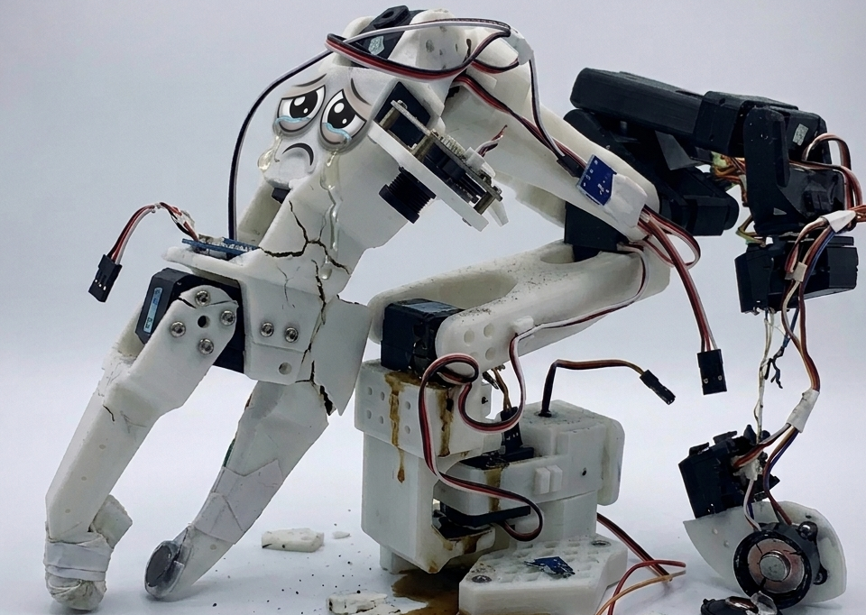

# Guardian Angle

*aka let's not break our robots*

Safety monitoring for the SO-101 robot arm.

[What is the SO-101?](https://github.com/ayerone/lerobot-intro)

There are reports of people burning out servos on the SO-101. Why is this happening? This repo started as an investigation into reading and monitoring motor currents with the purposes of keeping the servos happy, but has evolved to include other safety topics such as cartesian bounds in end-effector space and simulation-based testing.

## Chapters

| Chapter | Topic |
|---------|-------|
| [Chapter 01 — Motor Monitoring](chapter_01_motor_monitoring/) | Reading and visualizing servo load, current, and temperature in real time |
| Chapter 02 — Safe Movements *(Coming soon)* | Movement distance, joint velocities, and bus read sanity checks |
| Chapter 03 — Load Monitoring During Teleoperation *(Coming soon)* | Integrating motor load monitoring into lerobot-teleoperate |
| Chapter 04 — Simulation *(Coming soon)* | Testing and validating behavior in simulation before running on hardware |
| Chapter 05 — End Effector Coordinate Checking *(Coming soon)* | Determining effective cartesian bounds in end-effector space |

