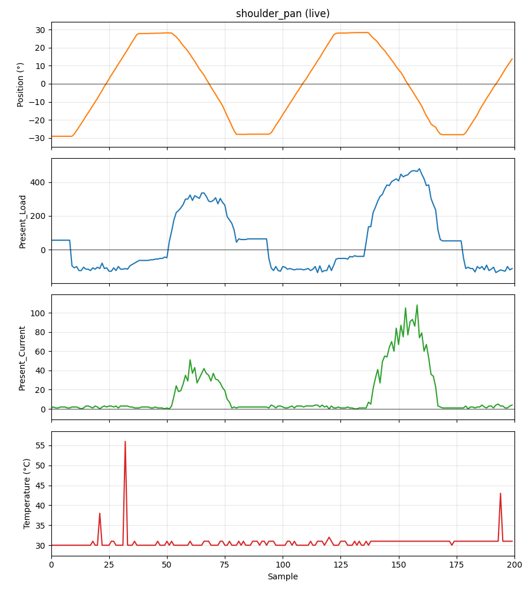

# Chapter 01 — Motor Monitoring

**Goal:** Monitor stress on the servo in real time. We'll use the shoulder pan servo as an example and display the motor's position, load, current, and temperature while the arm is stationary and moving.

---

## The question

Are there any warning signs that we can use to avoid damaging our robot's motors?

The LeRobot code that operates the SO-101 reads and writes positions to the motors, so what other information can we get from them that will help us solve this problem?

The Feetech STS3215 servos expose several feedback registers. Two stood out: `Present_Load` and `Present_Current`, so I started there.

**Present_Load and Present_Current**

`Present_Load` is the PWM duty cycle of the control output driving the motor. It is a signed value, corresponding to clockwise versus counterclockwise torque. ([STS e-manual, section 2.4](http://doc.feetech.cn/#/prodinfodownload?srcType=FT-SMS-STS-emanual-229f4476422d4059abfb1cb0))

`Present_Current` is the magnitude of the actual measured motor current (it's always non-negative).

## Building the live plot

I did this development in a Jupyter Notebook using [Datalayer's JupyterLab MCP server](https://github.com/datalayer/jupyter-mcp-server). The Jupyter server must be launched from within the lerobot venv so the notebook kernel has access to the lerobot package. Launch the Jupyter server and the MCP server from two separate terminals:

```bash
(venv) jupyter lab --port 8888 --IdentityProvider.token MAKE_UP_A_TOKEN
```

```bash
jupyter-mcp-server start --transport streamable-http --jupyter-url http://localhost:8888 --jupyter-token MAKE_UP_A_TOKEN --mcp-token PROVIDE_THIS_TO_CLAUDE --port 4040
```

The notebook reads the `Present_Position`, `Present_Load`, `Present_Current`, and `Present_Temperature` registers from the Feetech servo bus and updates a live plot using [Dash](https://dash.plotly.com/) and Plotly.

The Dash server starts in a background thread and returns immediately, keeping the kernel idle so plot updates reach the browser continuously. The robot motion and sensor reads run in a separate blocking cell via a simple `while` loop that steps the motor, reads the bus, and sleeps. The Dash callback reads from an in-memory buffer that the loop appends to.

## Experiment

I programmed the arm to sweep back and forth between -30° and +30° on the shoulder pan joint, pausing for 1 second at each extreme. At various points I applied resistance with my hand to see how much the load and current would increase in response.

## What the data showed



With the four-panel live plot running while the arm swept ±30° back and forth, a few things became clear:

**Resisting movement by hand increased both load and current, as expected.** The more resistance applied, the higher both values climbed.

**Load stays elevated after movement stops.** Even on the shoulder_pan joint, which rotates about a vertical axis and has essentially no gravitational load, Present_Load remains nonzero after the arm stops moving, presumably from the PID fighting stiction (static friction) in the high reduction ratio gearbox.

**Empirical calibration: ~6 mA per count.** I measured total system current with a DC ammeter while observing Present_Current in the notebook. At peak hand resistance the motor was drawing an additional 550 mA, while Present_Current was at 90 counts — giving roughly 6 mA/count.

## Where this leads

This chapter established which values to read from the motors and how to read them. The next question is: what does the data look like under normal operating conditions — during teleoperation, dataset recording, and policy rollout?

The next step is integrating these readings into `lerobot-teleoperate` or `lerobot-record` to monitor motor stress during actual operation. One challenge will be keeping the timing loop tight while adding extra bus reads. `Present_Load` or `Present_Current` could be sampled frequently as a real-time stress indicator, or `Present_Temperature` could be sampled every second or so and still potentially provide an early warning before damage occurs.

## Notebook

[motor_currents.ipynb](motor_currents.ipynb)
