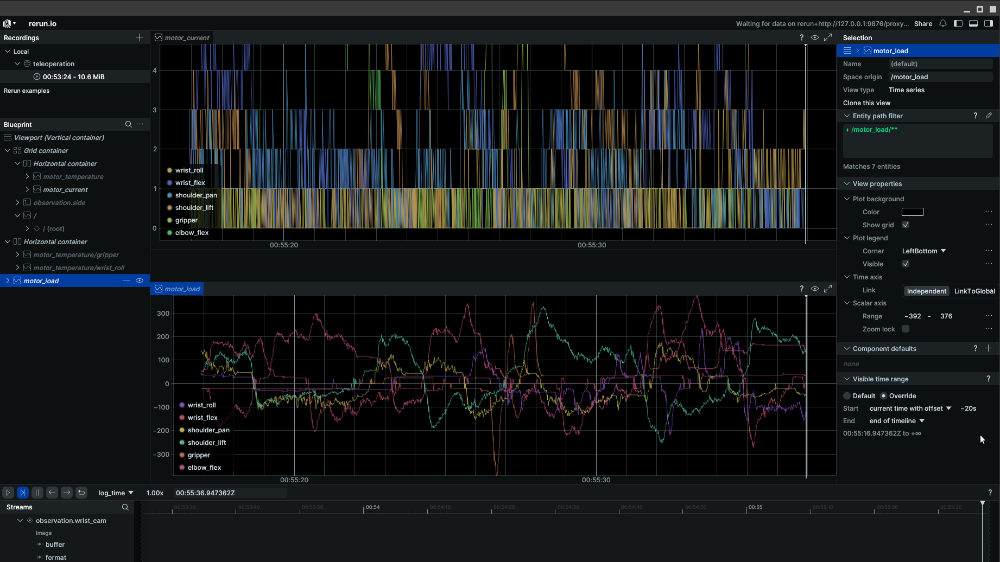
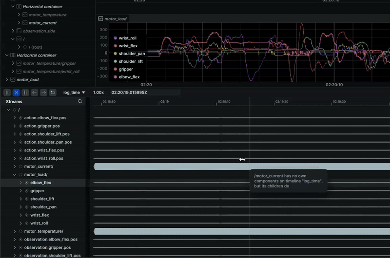
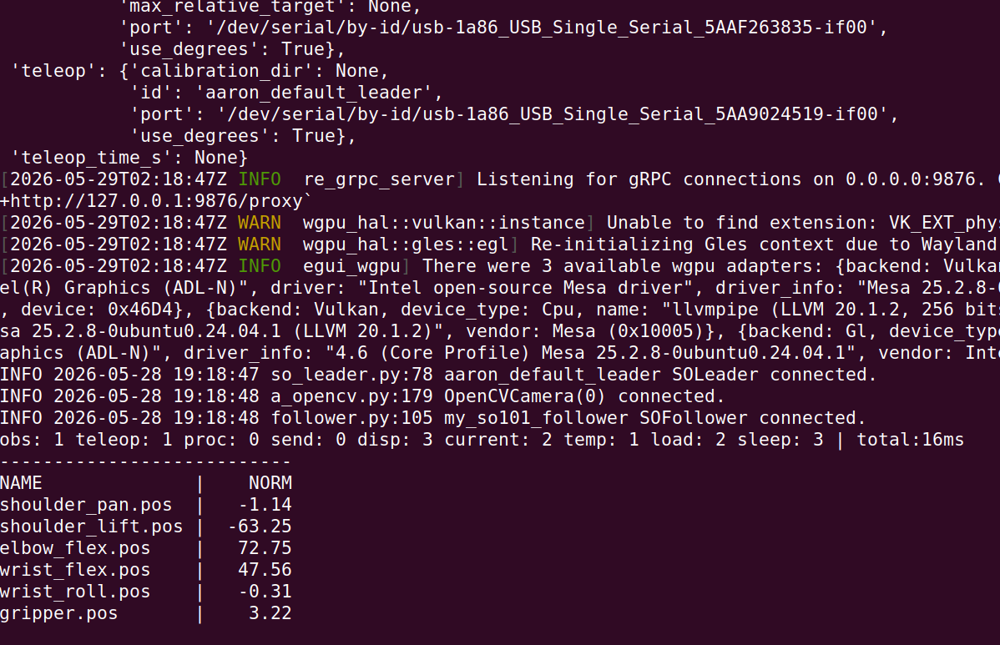

# Chapter 03 — Load Monitoring During Teleoperation



## What This Test Checks

Run this health check on your SO-101 arm to make sure there is no problem with the motors. Present_Load, Present_Current, and Present_Temperature (see [chapter_01_motor_monitoring](../chapter_01_motor_monitoring/README.md)) can be individually toggled on and off with command line options in config.sh to observe these quantities in Rerun while teleoperating the robot.

Catching errors caused by bad calibration, degrading motors, and dangerous operating habits can avoid robot downtime.

## Prerequisites

- SO-101 leader and follower arms connected and calibrated
- The Rerun extra installed (`pip install 'lerobot[viz]'`)

## Running the Test

In the `chapter_03_load_monitoring_teleop/` directory,

```bash
(venv) bash run_teleop.sh
```

This starts teleoperation with all three motor signals logging to Rerun. Test various movements to see what motor loads and currents this produces.



To add a graph:

1. Locate the **Streams** panel in Rerun.
2. Find the item you want to plot (`motor_current`, `motor_load`, etc.).
3. Right-click to open the context menu.
4. Hover over **Add to new view**.
5. Click **Time Series**.
6. The graph will appear in the central display panel.

## What I Saw

- Load and current are responsive to motor movements, and respond as you would expect to movements with and against gravity.
- As expected, resisting the robot's movements causes load and current to increase.
- At rest, load settles at a low level and current drops to single digits, even under gravity.
- Slow movements do not spike current or load.
- Temperature rises very slowly while exercising the robot.
- The temperature values do spike very high (above 50°C) occasionally for a single read, and this appears to be sensor noise.

## Impact to Teleop Loop Timing

Back in chapter 1, I flagged a concern: adding extra bus reads to get additional motor data might disrupt the speed with which we can run our teleop loop. It turns out the reads are very fast, and this added only about 1 ms per quantity, and the loop ran without issue.

I added smoothing (with an exponential moving average) to get them to print out in the terminal without flickering. Here are the rough numbers:

| Segment | What it measures | Observed (ms) |
|---------|-----------------|---------------|
| `obs` | Read follower positions (`robot.get_observation()`) | 1 |
| `teleop` | Read leader positions (`teleop.get_action()`) | 1 |
| `proc` | Action processor pipeline (in-memory) | 0 |
| `send` | Write positions to follower (`robot.send_action()`) | 0 |
| `disp` | Rerun logging of observations, actions, and images | 3 |
| `current` | `sync_read("Present_Current")` across all 6 motors | 2 |
| `temp` | `sync_read("Present_Temperature")` across all 6 motors | 1 |
| `load` | `sync_read("Present_Load")` across all 6 motors | 1 |
| `sleep` | `precise_sleep()` remainder of the 16.7 ms frame budget | 3 |
| **total** | | **16** |

The three monitoring reads together cost 4 ms. The loop still had 3 ms of sleep left, meaning it was not overrunning its 60 fps budget. The core teleop path (`obs` + `teleop` + `proc` + `send`) consumed only 2 ms, so there is room to spare even with all three reads enabled simultaneously.


