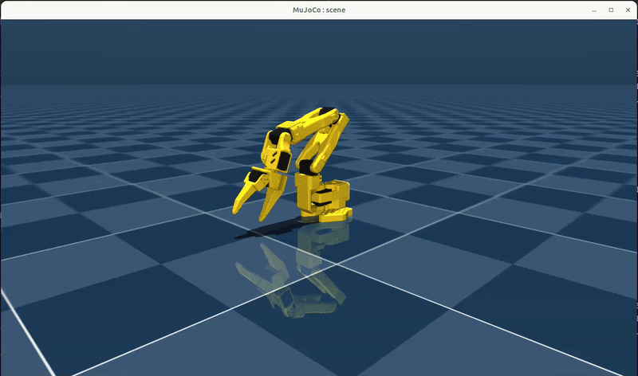

# Chapter 04 — Simulation



## Why Simulation?

Simulation is an extremely powerful tool in robotics. It lets you:

- **Explore safely**: test control algorithms without risking damage to your hardware
- **Iterate fast**: test ideas without risking expensive real-world consequences
- **Train policies with reinforcement learning**: generate many more episodes of experience than is possible on a real robot
- **Validate before deploying**: build confidence in a behavior in simulation before running it on hardware

This chapter sets up MuJoCo simulation for the SO-101 and introduces keyboard-based end-effector teleoperation in the simulated environment.

## Getting Started

Install mujoco and required extra dependencies:

```bash
(venv) pip install mujoco 'lerobot[kinematics]' 'lerobot[hardware]'
```

The simulation requires the SO-101 MuJoCo scene files — the URDF and XML assets that describe the robot's geometry, joints, and physics properties. Run the following from the `chapter_04_simulation/` directory to download just that folder:

```bash
git clone --filter=blob:none --sparse https://github.com/TheRobotStudio/SO-ARM100
git -C SO-ARM100 sparse-checkout set Simulation/SO101
cp -r SO-ARM100/Simulation/SO101 ./SO101
rm -rf SO-ARM100
```

Then run the simulation:

### Real-world SO-101 Leader Teleop

```bash
(venv) bash run_sim_leader_teleop.sh
```

### Keyboard Teleop

```bash
(venv) python ./sim_keyboard_teleop.py
```

(A guide to the keyboard controls is printed to the terminal on startup.)

**Wayland note:** `pynput` (used by lerobot for keyboard capture) does not work (for me) under Wayland. Launch the script from an XWayland terminal such as `xterm`. **The terminal window must remain in focus for keyboard input to reach the simulation.**

## Operating the Simulation

You should see the robot in the simulated environment.

### Real-world SO-101 Leader Teleop

Move the leader arm and the simulated follower will mirror it in real time.

### Keyboard Teleop

Pressing the arrow keys, shift, and ctrl should cause the robot to move.

The keyboard commands move the end-effector (the gripper tip) through Cartesian space: left/right, forward/back, up/down. But the robot's motors don't understand Cartesian coordinates; they operate in joint space, where each value is an angle for a specific servo. Bridging that gap is the job of inverse kinematics (IK).

In `sim_keyboard_teleop.py`, each keypress produces a small XYZ delta. That delta is added to the current desired end-effector position, giving a new target pose in 3D space. The IK solver (placo) then works backwards from that target pose to find a set of joint angles that would place the gripper there. Those joint angles are written to the actuators simulated by MuJoCo, and the physics simulation moves the arm accordingly.
